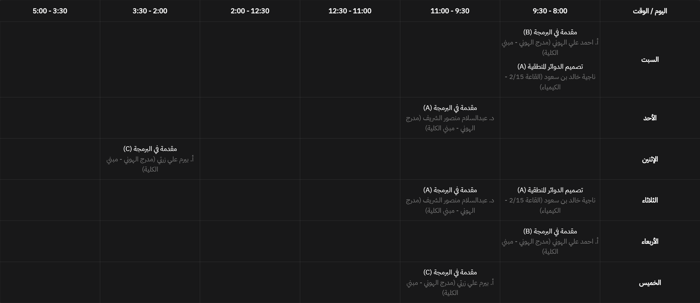

from 
```json
[
  {
    "subject_id": 1,
    "subject_name": "مقدمة في البرمجة",
    "subject_code": "ITGS122",
    "subject_department": "القسم العام",
    "midterm": {
      "date": "2023-12-02",
      "period": 1
    },
    "final": {
      "date": "2024-01-06",
      "period": 1
    },
    "groups": [
      {
        "group_code": "B",
        "professor": "أ. احمد علي الهوني",
        "lectures": [
          {
            "day": "السبت",
            "start_time": "8:00",
            "end_time": "10:00",
            "room": "(مدرج الهوني - مبني الكلية)"
          },
          {
            "day": "الأربعاء",
            "start_time": "8:00",
            "end_time": "10:00",
            "room": "(مدرج الهوني - مبني الكلية)"
          }
        ]
      },
      {
        "group_code": "A",
        "professor": "د. عبدالسلام منصور الشريف",
        "lectures": [
          {
            "day": "الأحد",
            "start_time": "10:00",
            "end_time": "12:00",
            "room": "(مدرج الهوني - مبني الكلية)"
          },
          {
            "day": "الثلاثاء",
            "start_time": "10:00",
            "end_time": "12:00",
            "room": "(مدرج الهوني - مبني الكلية)"
          }
        ]
      },
      {
        "group_code": "C",
        "professor": "أ. بيرم علي زرتي",
        "lectures": [
          {
            "day": "الإثنين",
            "start_time": "4:00",
            "end_time": "6:00",
            "room": "(مدرج الهوني - مبني الكلية)"
          },
          {
            "day": "الخميس",
            "start_time": "10:00",
            "end_time": "12:00",
            "room": "(مدرج الهوني - مبني الكلية)"
          }
        ]
      }
    ]
  },
  {
    "subject_id": 2,
    "subject_name": "تصميم الدوائر المنطقية",
    "subject_code": "ITGS126",
    "subject_department": "القسم العام",
    "midterm": {
      "date": "2023-12-07",
      "period": 1
    },
    "final": {
      "date": "2024-01-15",
      "period": 1
    },
    "groups": [
      {
        "group_code": "A",
        "professor": "ناجية خالد بن سعود",
        "lectures": [
          {
            "day": "السبت",
            "start_time": "8:00",
            "end_time": "10:00",
            "room": "(القاعة 2/15 - الكيمياء)"
          },
          {
            "day": "الثلاثاء",
            "start_time": "8:00",
            "end_time": "10:00",
            "room": "(القاعة 2/15 - الكيمياء)"
          }
        ]
      }
    ]
  }
]
```
to

